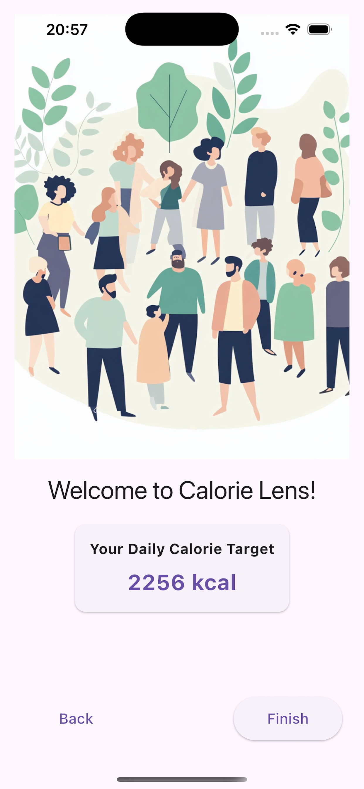
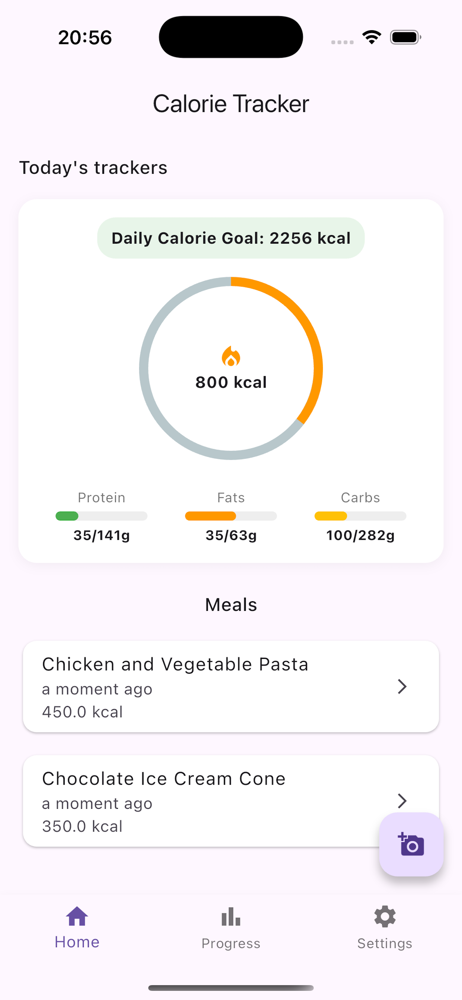
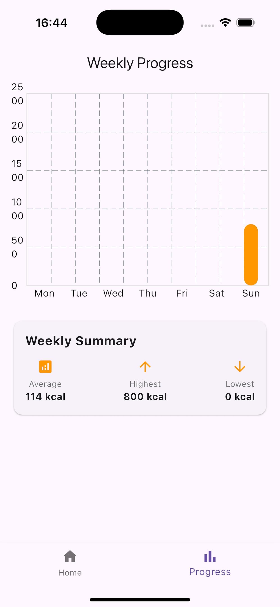
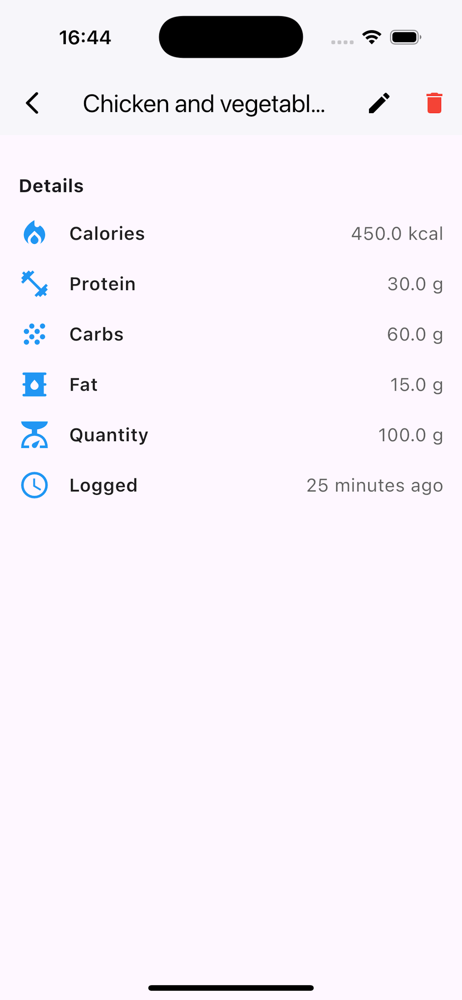

# Calorie Detector App

Welcome to the **Calorie Detector App**! This Flutter app uses Google Gemini AI to analyze food images and provide detailed nutritional information, including calorie count, protein, carbs, and fat content. With its user-friendly design and seamless AI integration, this app helps you track your meals and maintain your health goals effortlessly.

---

## Screenshots
| Welcome Screen | Main Screen |
|:---:|:---:|
|  |  |

| Progress Screen | Edit Screen |
|:---:|:---:|
|  |  |

## Features

1. **Onboarding Screen**:
   - Introduces users to the app's functionality.
   - Provides a quick walkthrough of how to use the app.

2. **Tracker Screen**:
   - Capture or upload food images to analyze nutritional details.
   - View AI-generated insights for each detected food item.

3. **Progress Screen**:
   - Monitor your daily, weekly, or monthly calorie intake.
   - Visualize progress with charts and summaries.

4. **Settings Screen**:
   - Customize your preferences, like daily calorie goals.
   - Manage account details and app configurations.

---

## How to Run the App

### Prerequisites
1. Install [Flutter](https://flutter.dev/docs/get-started/install) and set up your development environment.
2. Clone this repository and navigate to the project folder.

### Environment Setup
1. Create a `.env` file in the root of the project.
2. Add your Google Gemini AI API key in the `.env` file:
   ```env
   GOOGLE_AI_API_KEY=your_google_gemini_api_key_here
   ```

3.	Ensure you have set up the necessary permissions for accessing the camera and gallery in the respective platform configurations.

### Running the App
	1.	Install dependencies:
    ```bash
    flutter pub get
    ```
2.	Run the app:
    ```bash
    flutter run
    ```

### Dependencies
- [gemini-1.5-pro](https://gemini.google.com/models/gemini-1.5-pro)
- [flutter_dotenv](https://pub.dev/packages/flutter_dotenv)

### Contribution

We welcome contributions to enhance the app! Feel free to:
	1.	Fork the repository.
	2.	Create a new branch.
	3.	Make your changes.
	4.	Submit a pull request with a detailed description.

### License

This project is licensed under the MIT License.

Stay Healthy, Stay Happy! 🚀